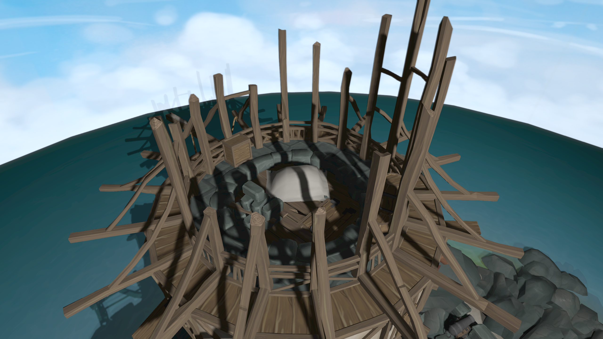
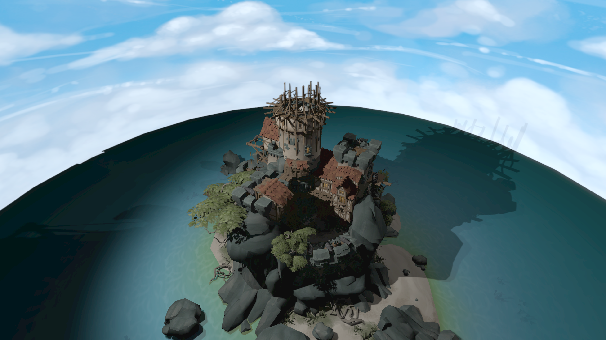

# GLHelper

C++ library for OpenGL abstraction, with the primary goal of learning about OpenGL and principals of 3D graphical rendering.

## Build Dependencies:

- GLFW (utility library and window manager library used by GLHelper): https://www.glfw.org/
- Assimp (Open Asset Import Library): https://github.com/assimp/assimp

## Build:

To make all files, use:
```shell
make
```

To make the test executable:
```shell
make test
```

To clean all build files:
```shell
make clean
```

## Features:

- Integrated shadow mapping, including dual paraboloid shadow mapping for point lights.
- Soft shadow edges using PCF (percentage-closer filtering)
- 'Bloom' is applied to surfaces with emission maps (using gaussian filtering).
- Supports bump (normal) maps for surfaces.
- Uses a compute shader to preprocess translucent faces of meshes.
  - Opaque meshes can use deferred rendering (using G-buffer).
  - Translucent meshes can then be forward-rendered at a later stage, after having rendered the opaque geometry. 
- Uses my own implementation of FXAA (Fast Approximate Antialiasing).

## Screenshots:




